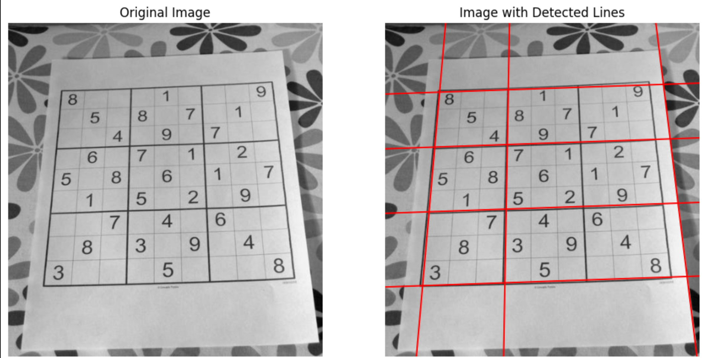
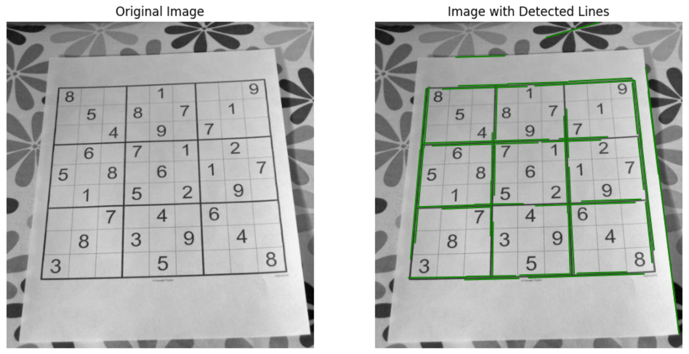
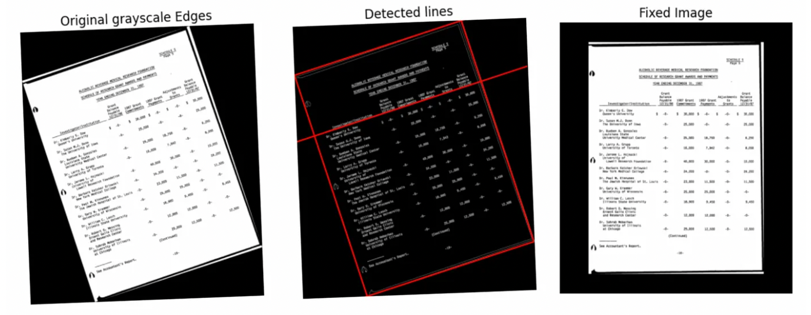

# hough-transform
This Repo uses the Hough Transform Technique to detect straigh lines in an image, with results as below;

## Standard Hough Tranform

## Probabilistic Hough Tranform

## Document Rotation using Hough Tranform

